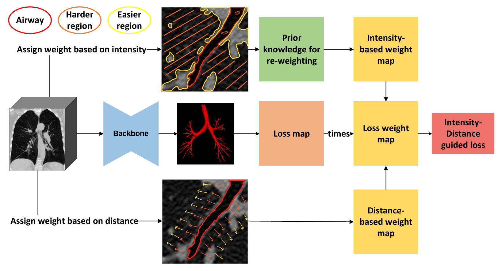
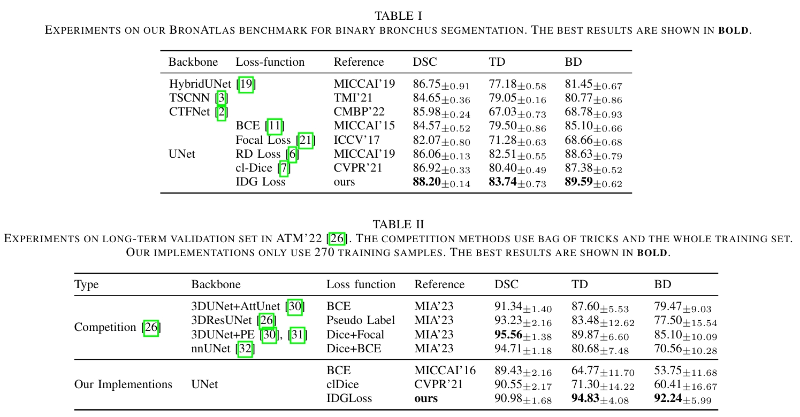
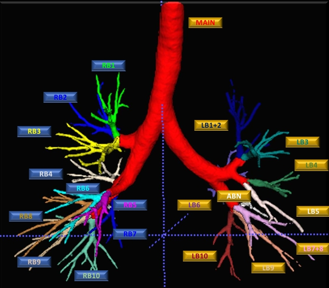

# Intensity Confusion Matters: An Intensity-Distance Guided Loss for Bronchus Segmentation

## Introduction
Bronchus segmentation from computed tomography (CT) imaging plays a crucial role in structural analysis for disease diagnosis. Existing methods have primarily focused on enhancing segmentation accuracy but often overlook the issue of "Intensity Confusion." This phenomenon occurs when the intensity values of bronchus regions (foreground) closely resemble those of the surrounding tissues (background), posing significant challenges for segmentation models. To address this, we introduce a novel Intensity-Distance Guided loss function that dynamically adjusts weights to prioritize hard samples based on their intensity proximity and spatial distance to the bronchus.

## Methodology
Our method leverages intensity and distance metrics to identify and prioritize hard samples—voxels where intensity values cause confusion between bronchus and non-bronchus regions. By integrating these metrics into our loss function, the model can focus on challenging areas, improving the robustness and accuracy of the segmentation.



## Results
Our approach demonstrates superior performance over existing state-of-the-art methods, particularly in handling regions with high intensity confusion. The effectiveness of tackling intensity confusion in improving segmentation results is thoroughly validated through extensive testing.



## Dataset Description
You may directly download this dataset from [OSF](https://osf.io/pskr9/?viewonly=94fa3d87274b4095ac9a4b88cc9a1341.). For the development of automatic bronchus diagnosis, we contribute a new benchmark, BronAtlas, for bronchus classification. BronAtlas has 100 cases of lung CT imaging with voxel-level annotations of 20 segmental bronchi categories (i.e., 10 from the right lung, 8 from the left lung, 1 for the main trachea, and 1 for abnormal bronchus). The "abnormal bronchus segment" denotes the congenital abnormal bronchus. There are 33 abnormal cases in the training and validation set and 12 abnormal cases in the test set. The visualization of the 20 bronchial categories is shown below.



To use this dataset, please cite the following papers:
[IEEE TMI 2024, BCNet](https://ieeexplore.ieee.org/stamp/stamp.jsp?tp=&arnumber=10644043)
[IEEE ICME 2024, Intensity](https://arxiv.org/pdf/2406.16150)

```bibtex
@article{huang2024bcnet,
  title={BCNet: Bronchus Classification via Structure Guided Representation Learning},
  author={Huang, Wenhao and Gong, Haifan and Zhang, Huan and Wang, Yu and Wan, Xiang and Li, Guanbin and Li, Haofeng and Shen, Hong},
  volume={43},
  journal={IEEE Transactions on Medical Imaging},
  year={2024}
}

@inproceedings{gong2024intensity,
  author    = {Haifan Gong and Wenhao Huang and Huan Zhang and Yu Wang and Xiang Wan and Hong Shen and Guanbin Li and Haofeng Li},
  title     = {Intensity Confusion Matters: An Intensity-Distance Guided Loss for Bronchus Segmentation},
  booktitle = {IEEE International Conference on Multimedia and Expo},
  year      = {2024},
  location  = {Niagara Falls, Canada}
}
```
## Open Source Statement
Due to the integration of our project into commercial products at [Infervision](https://www.infervision.com/), we are unable to release the source code. We appreciate your understanding as we balance open science with commercial obligations.

